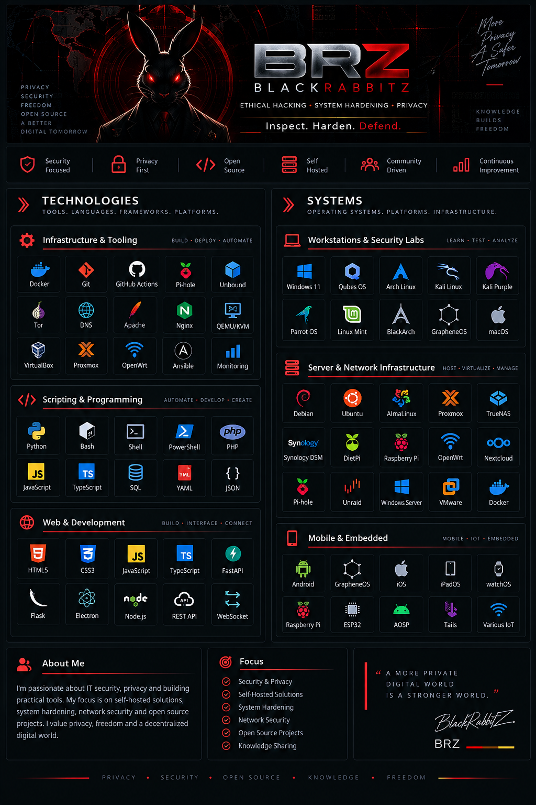

---

<h2 align="center">📦 Projects</h2>

<table align="center" width="85%">
  <thead>
    <tr>
      <th align="center">Project</th>
      <th align="center">Description</th>
      <th align="center">Focus</th>
    </tr>
  </thead>
  <tbody>
    <tr>
      <td align="center">
        <a href="https://github.com/BlackRabbitZ/Pi-Hole-Projects">
          Pi-Hole-Readme
        </a>
      </td>
      <td align="center">
        Overview of my Pi-hole projects
      </td>
      <td align="center">
        DNS • Privacy • Hardening
      </td>
    </tr>
    <tr>
      <td align="center">
        <a href="https://github.com/BlackRabbitZ/Onion-Projects">
          Onion-Projects
        </a>
      </td>
      <td align="center">
        Overview of my Tor and Onion projects
      </td>
      <td align="center">
        Tor • Privacy • E2EE
      </td>
    </tr>
  </tbody>
</table>

---

<h2 align="center">ℹ️ Info</h2>

**Language:** German (Deutsch)  
**Discord:** German-speaking community • application-only access  
**Apply:** [discord.gg/XX4E7FtXWk](https://discord.gg/XX4E7FtXWk)

